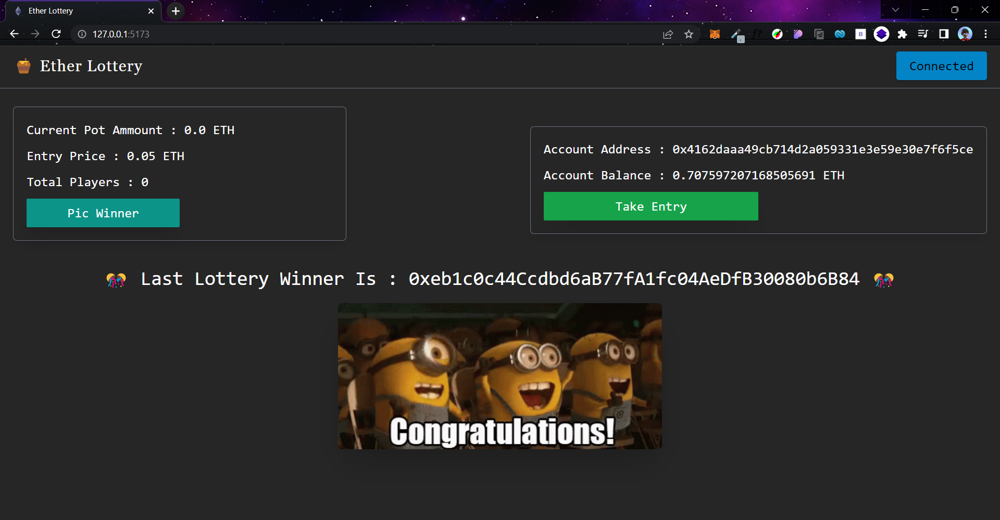

# Ether Lottery


The MagnumZ web app lets you buy the MagunZ token (like Doge Coin Token) using the Goerli test network.

## 🚀 Live Demo

- Click Here : [@Ether Lottery](https://ether-lottery.netlify.app/)

## 👀 Overview




## 🧑‍💻 Author

- [@Zeel Rabadiya](https://www.github.com/l33Z)

## 💻 Run Locally

Clone the project

```bash
  git clone https://link-to-project
```

Go to the project directory

```bash
  cd project directory
```

Install dependencies

```bash
  npm install
```

Go to client directory

```bash
  cd client
```
Install dependencies

```bash
  npm install
```
Start the server
```bash
  npm start
```
**Make Sure You Are Connected To Goerli Testnetwork To Metamask**


## ⚙️ Tech Stack

**Client:** React, ether.js, tailwind.css

**Blockchain:** Goerli, Infura, Truffle, Solidity